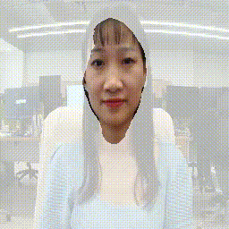

# Face Segmentation

## Introduction
This post is about face segmentation based on LinkNet34, our work is inspired by this PyTorch [implementaion](https://github.com/JiaojiaoYe1994/face-segmentation).


## Get started

### Installation

```
pip install scipy
pip install matplotlib
pip install opencv-python
pip install oneflow
```


### Data preparation

We provide compressed dataset, please download dataset from [here](https://oneflow-static.oss-cn-beijing.aliyuncs.com/train_data_zjlab/faceseg_data.zip) , unzip it and put it in `./data`


### Train a model

Our model is trained using ResNet backbones, which can be downloaded  [here](https://oneflow-static.oss-cn-beijing.aliyuncs.com/train_data_zjlab/faceseg_backbones.zip) , download and unzip it.


To train a model, running

```python train.py```


### Test a model
To test a model, running

```python test.py```


### Results demonstration

Besides, we provide pretrained model [here](https://oneflow-static.oss-cn-beijing.aliyuncs.com/train_data_zjlab/faceseg_model.zip) , download and unzip it.


We compare visualization performance of our OneFlow model with PyTorch benchmark, the following displays some segmented results on the data.


To better show the performance, the following is a real-world demonstration of our face segmentation model. 


{:height="50%" width="50%" align="center"}

