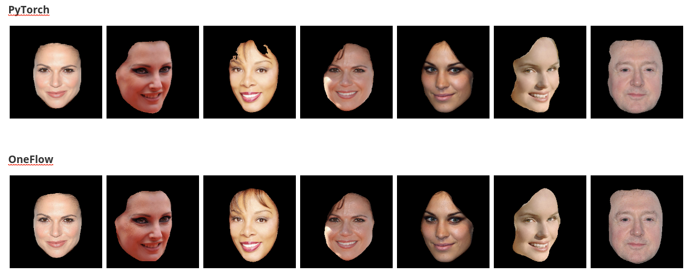

# Face Segmentastion

## Introduction
This posts is about face recognition based on LinkNet34, our work is inspired by [implementaion](https://github.com/JiaojiaoYe1994/face-segmentation).


## Dependencies

## Get started

### Installation

```
pip install scipy
pip install matplotlib
pip install opencv-python
pip install oneflow
```


### Data preparation

We provide compressed dataset, please download dataset from [here](https://oneflow-static.oss-cn-beijing.aliyuncs.com/train_data_zjlab/faceseg_data.zip) , unzip it and put it in `./data`

Besides, we provide pretrained model [here](https://oneflow-static.oss-cn-beijing.aliyuncs.com/train_data_zjlab/faceseg_model.zip) , download and unzip it.


### Train a model
To train a model, running

```python train.py```


### Test a model
To test a model, running

```python test.py```


### Results demonstration


