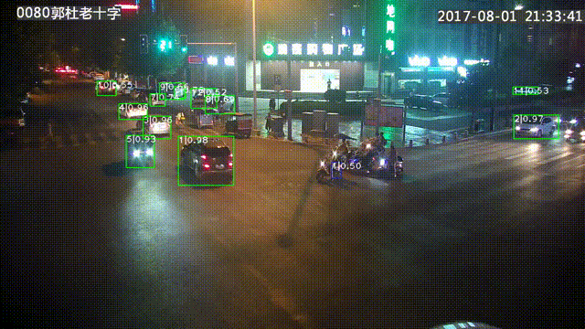

# ResTrack

## Introduction
This post is about Multi-Object Tracking based on oneflow, our work is inspired by this PyTorch [implementaion](https://github.com/ZQPei/deep_sort_pytorch).


## Get started

### Requirement

```
oneflow
opencv
scipy
```
**Note:** Install the oneflow with yolov3, which can be download [here](https://oneflow-static.oss-cn-beijing.aliyuncs.com/train_data_zjlab/restrack/oneflow-0.2b2-cp36-cp36m-linux_x86_64.whl).


### Data preparation

put your demo video here ./data/video

### Train a model

Our model training is based on [reid](https://github.com/Oneflow-Inc/oneflow_vision_model/tree/main/Re-ID) and [yolov3](https://github.com/Oneflow-Inc/oneflow_yolov3), which can be refered for training 


### Test a model

we provide pretrained model [here](https://oneflow-static.oss-cn-beijing.aliyuncs.com/train_data_zjlab/restrack/yolov3_model_python.zip) , download and unzip it and put it in ./yolov3/of_model.

```python res_track.py```


### Results demonstration

[demo.avi](https://oneflow-static.oss-cn-beijing.aliyuncs.com/train_data_zjlab/restrack/demo.avi) , [demo_res.avi](https://oneflow-static.oss-cn-beijing.aliyuncs.com/train_data_zjlab/restrack/demo_res.avi)

{:height="50%" width="50%" align="center"}
